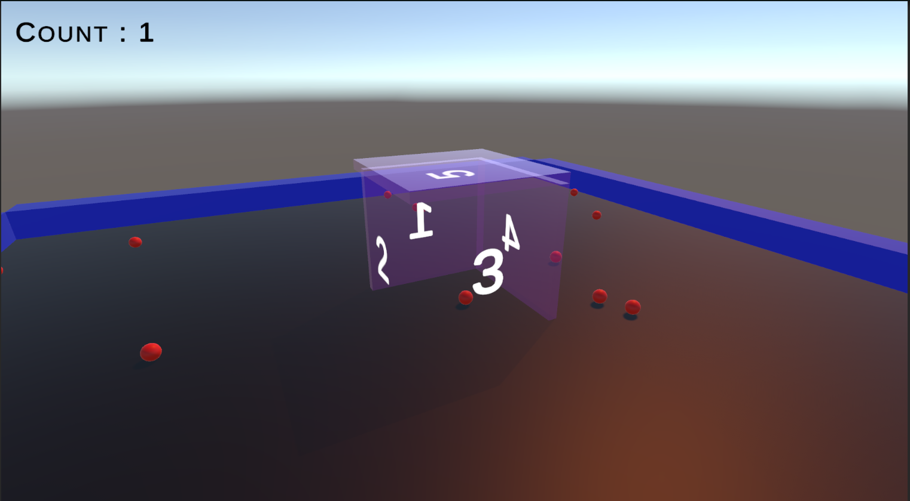

# Count in Box

## Project
Count in Box project is a basic prototype to count the objects in a specific area
in this project, player has a goal to keep balls in the box as much as he/she can.

### Controls
A: Rotate to left
D: Rotate to right
1: Activate 1st box side
2: Activate 2nd box side
3: Activate 3rd box side
4: Activate 4th box side
5: Activate 5th box side

### On-Screen Indicators
Counter: Counts how many balls are in the box continuously

### How to Play
Upon starting the game, balls will spawn within the game area, exhibiting dynamic movement and bouncing off every collider they encounter. The objective is to skillfully maintain the balls within the confines of the designated box object using the provided control keys (1, 2, 3, 4, 5).

### Screenshot

